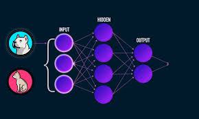
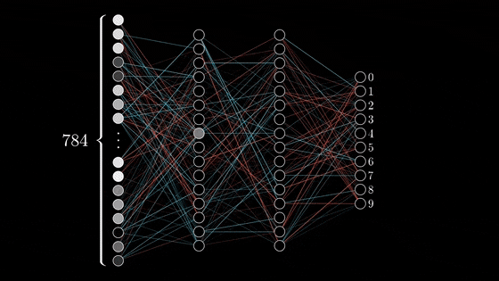
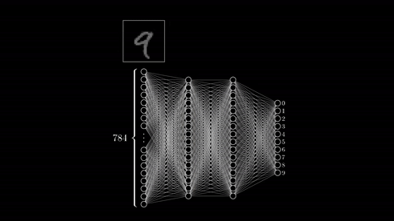

## Deep Learning Model
This repository contains the code for various Deep Learning Models.

### Project Structure
```
├── Transfer-Learning	 # Transfer Learning code 
├── images               # Images 
├── Readme               # Readme 
```

#### Deep Learning Models :

	

##### Images source : [Google](www.google.com)

Deep learning is an artificial intelligence function that imitates the workings of the human brain in processing data and creating patterns for use in decision making. Deep learning is a subset of machine learning in artificial intelligence (AI) that has networks capable of learning unsupervised from data that is unstructured or unlabeled. Also known as deep neural learning or deep neural network.

## Deep Learning Model Process: 
##### Images source : [Google](www.google.com)



 	


