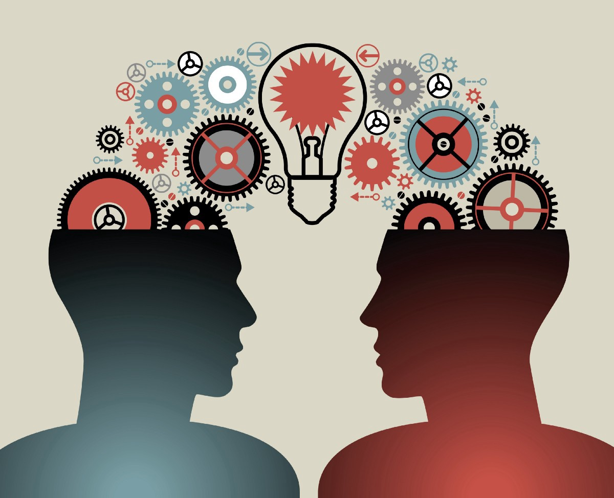
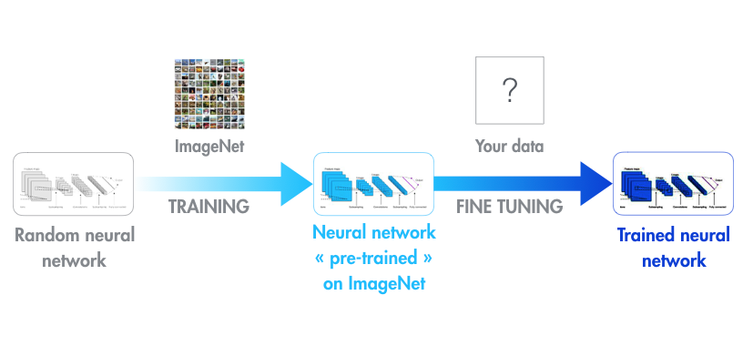
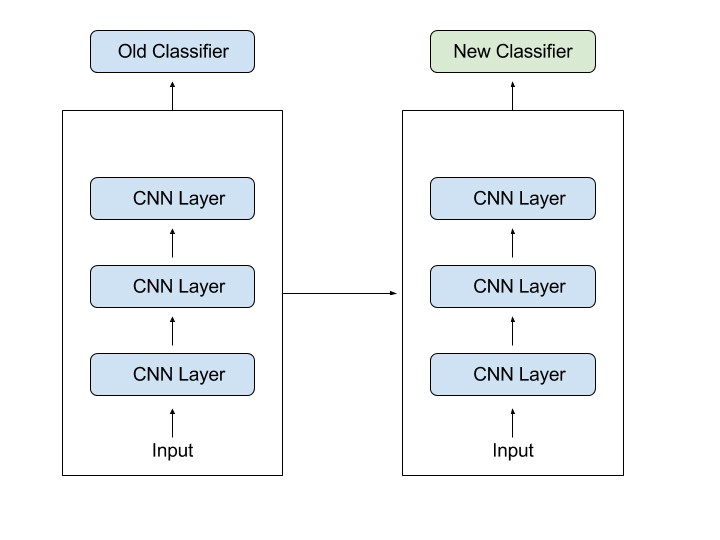

## Deep Learning Model
This repository contains the code for various Deep Learning Models.

### Project Structure
```
├── src             	 # source code
├── images               # Images 
├── requirements.txt     # Requirements file 
├── Readme               # Readme 
```

#### Transfer Learning Models :

Transfer learning is a machine learning method where a model developed for a task is reused as the starting point for a model on a second task.

Transfer Learning differs from traditional Machine Learning in that it is the use of pre-trained models that have been used for another task to jump start the development process on a new task or problem.




Often many Machine Learning questions offer datasets that may be very horizontal and not conducive to applying a ML solution initially. To account for this you can train a Deep Convolutional Neural Net on ImageNet and then use a technique called a Warm Restart to refine the algorithm on the “target” dataset.

By pre-training the neural network on ImageNet you can then re-use it on your target data set as the lower layers are already trained on recognizing shapes and sizes. You can the refine the upper layers for your target data set.




## Popular Transfer Learning Model:

There are a some pre-trained Machine Learning models out there that became quite popular. One of them is the Inception-v3 model, which was trained for the ImageNet “Large Visual Recognition Challenge”. In this challenge, participants had to classify images into 1000 classes, like “Zebra”, “Dalmatian”, and “Dishwasher”.




##### Images source : [Google](www.google.com)

### Requirements file

`virtualenv --python=python3 env_tl`

`source env_tl/bin/activate`

`pip intsall -r requirements.txt`

